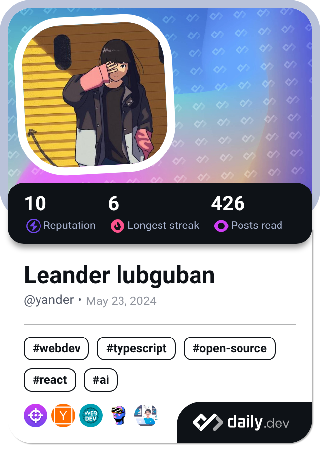

<table style="border-collapse: collapse; border: none; width: 100%;">
  <tr>
    <td style="vertical-align: top; border: none; width: 50%;">
      
    </td>
    <td style="vertical-align: top; padding-left: 20px; border: none; width: 100%;">
      <h1>👋 Hello, I'm Leander Lubguban!</h1>
      

        Welcome to my GitHub profile! I'm passionate about 
        <strong>software development</strong> and <strong>building awesome applications</strong>, and libraries.
      

      

        
      

      

        
        
      

    </td>
  </tr>
</table>
